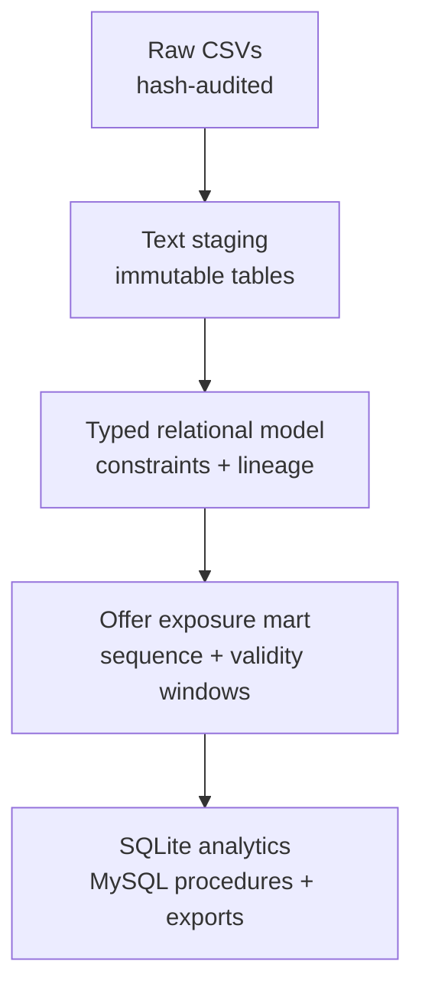

# Starbucks Offers SQL Analytics Pipeline

A reproducible SQL portfolio project that turns 323,544 simulated Starbucks
records into an audited relational model, sequence-aware offer analytics, and a
MySQL 8 stored-program demonstration. Raw CSV files are never modified.

> Independent educational project. Not affiliated with Starbucks.

## Executive summary

The source records contain nested list/dictionary text, incomplete customer
profiles, exact repeated events, and multiple deliveries of the same offer to
the same customer. This project solves those issues with a governed pipeline
rather than editing the CSVs or cleaning data manually.

| Verified outcome | Result |
|---|---:|
| Source records reconciled | 323,544 |
| Clean offers / customers / events | 10 / 17,000 / 306,534 |
| Sequence-aware offer exposures | 76,277 |
| Exact repeated events retained and flagged | 397 |
| Profiles with transparent imputation flags | 2,175 |
| Hard validation errors / orphaned references | 0 / 0 |
| Exposure sequence violations / rates above 100% | 0 / 0 |
| MySQL presentation methods covered | 9 / 9 |
| SQLite integrity check | `ok` |

## Business problem

The useful question is not simply how many offer events exist. It is whether a
specific offer delivery was viewed and completed in the correct order while
the offer was still valid.

The exposure mart matches every `offer_received` event to:

1. the first later view within the offer duration and before the next delivery
   of the same offer;
2. the first completion in that same exposure window; and
3. the first completion that occurs after a recorded view.

This prevents a completion from being counted against multiple deliveries and
keeps all offer rates between 0 and 1.

## Selected findings

- 56,567 of 76,277 exposures were viewed: **74.16%**.
- 33,101 exposures had a completion in the validity window, but only 23,282
  completed after a recorded view. The 9,819 remaining completions should not
  be treated as view-driven conversions.
- Discount offers had a **40.41%** qualified completion rate from receipt,
  compared with **35.87%** for BOGO offers.
- BOGO offers had the higher view rate—**82.79%** versus **69.97%** for
  discounts—showing that engagement and qualified completion are different
  decisions.
- The strongest individual offer was the four-channel discount
  `fafdcd668e3743c1bb461111dcafc2a4`, with a **60.37%** qualified completion
  rate from receipt.

These are descriptive results from simulated data, not causal uplift
estimates. See [BUSINESS_INSIGHTS.md](BUSINESS_INSIGHTS.md) for the full
interpretation and recommendations.

## Architecture



| Layer | Main objects | Purpose |
|---|---|---|
| Audit | `etl_run`, `source_file_audit`, `etl_error_log`, `data_quality_summary` | Prove row reconciliation and source integrity |
| Raw | `raw_portfolio`, `raw_profile`, `raw_transcript` | Preserve source-shaped text without overwriting CSVs |
| Clean | `portfolio`, `portfolio_channel`, `customer_profile`, `transcript_event` | Standardize types, categories, JSON, and references |
| Analytical mart | `offer_exposure` | Match receipt, view, and completion events safely |
| Analytics | Funnel and window-function views | Reusable customer and offer analysis |
| MySQL 8 | Nine stored procedures | Demonstrate parameters, loops, and conditional logic |

## Technical coverage

- Python standard-library ETL runner; no third-party packages required
- SQLite constraints, foreign keys, triggers, indexes, views, CTEs, and JSON
- `ROW_NUMBER`, `DENSE_RANK`, `SUM OVER`, and `COUNT OVER`
- Exact-duplicate detection without destructive deletion
- Nullable clean fields plus separately named median-imputed fields and flags
- MySQL procedures with no parameters, `IN`, `OUT`, and `INOUT`
- MySQL `WHILE`, `REPEAT`, `LOOP`, `LEAVE`, `ITERATE`, `MOD`, and
  `IF / ELSEIF / ELSE`
- Automated fixture integration tests and MySQL container smoke tests

## Repository structure

```text
.
├── .github/workflows/ci.yml       # SQLite and MySQL validation
├── data/raw/README.md             # source download instructions
├── mysql/                         # MySQL schema, loader, views, procedures
├── output/                        # compact evidence; large files are ignored
├── sql/                           # SQLite schema, ETL, QA, analytics
├── src/                           # reproducible Python runners
├── tests/                         # synthetic non-destructive integration fixture
├── BUSINESS_INSIGHTS.md
├── DATA_DICTIONARY.md
├── DATA_SOURCE.md
└── PRESENTATION_METHODS.md
```

## Reproduce the SQLite pipeline

Requirements: Python 3.10+ with SQLite JSON and window-function support.

1. Download the three CSV files from the
   [Kaggle dataset](https://www.kaggle.com/datasets/ihormuliar/starbucks-customer-data/data).
2. Place `portfolio.csv`, `profile.csv`, and `transcript.csv` in `data/raw/`.
3. Run:

```bash
python3 src/run_pipeline.py \
  --raw-dir data/raw \
  --output-dir output \
  --overwrite
```

The command creates the SQLite database, clean CSV exports, aggregate results,
an error log, and a validation report. The raw-file hashes are recorded before
and after processing; the run fails if a source file changes.

Run the repository tests without downloading the full dataset:

```bash
python3 -m unittest discover -s tests -v
python3 src/validate_presentation_methods.py --static-only
```

## Run the MySQL 8 layer

The MySQL layer imports only the generated clean exports. Run the SQLite
pipeline first, then:

```bash
cp mysql/.env.example mysql/.env
# Replace the placeholder local passwords in mysql/.env.

docker compose --env-file mysql/.env \
  -f mysql/docker-compose.yml up -d --wait
```

Run all presentation-method smoke tests:

```bash
docker compose --env-file mysql/.env \
  -f mysql/docker-compose.yml exec -T mysql \
  sh -c 'mysql -u"$MYSQL_USER" -p"$MYSQL_PASSWORD" "$MYSQL_DATABASE"' \
  < mysql/tests/smoke_test.sql
```

See [PRESENTATION_METHODS.md](PRESENTATION_METHODS.md) for the one-to-one
assignment map and call examples.

## Useful queries

```sql
-- Compare sequence-qualified offer performance.
SELECT *
FROM vw_offer_performance
ORDER BY qualified_completion_rate_from_received DESC;

-- Inspect one exposure from receipt through its qualified completion.
SELECT *
FROM offer_exposure
WHERE customer_id = 'CUSTOMER_ID_HERE'
ORDER BY received_hour;

-- Rank the highest-spending customers within each gender group.
SELECT *
FROM vw_customer_spend_rank_by_gender
WHERE spending_rank_within_gender <= 10
ORDER BY gender_label, spending_rank_within_gender;

-- Review every logged cleaning rule.
SELECT severity, rule_code, source_table, COUNT(*) AS affected_rows
FROM etl_error_log
GROUP BY severity, rule_code, source_table
ORDER BY severity, affected_rows DESC;
```

## Data and analytical safeguards

- The source dataset is simulated and is not committed to this repository.
- Raw staging tables block `UPDATE` and `DELETE` after loading.
- Age `118` is treated as the dataset's missing-value sentinel, not a real age.
- Exact repeated events remain available with lineage and duplicate flags.
- Transaction amounts are not attributed to offers because the source contains
  no direct offer-to-transaction key.
- Offer completion after a recorded view is a conservative sequence rule; it
  does not prove the offer caused the purchase.

Detailed definitions are in [DATA_DICTIONARY.md](DATA_DICTIONARY.md), and the
latest full-data checks are in
[output/validation_report.md](output/validation_report.md).
